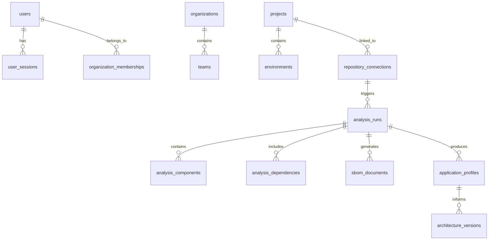

# AetherOps Entity Relationship Diagram

```mermaid
erDiagram
    users ||--o{ user_sessions : has
    users ||--o{ organization_memberships : belongs_to
    organizations ||--o{ teams : contains
    projects ||--o{ environments : contains
    projects ||--o{ repository_connections : linked_to
    repository_connections ||--o{ analysis_runs : triggers
    analysis_runs ||--o{ analysis_components : contains
    analysis_runs ||--o{ analysis_dependencies : includes
    analysis_runs ||--o{ sbom_documents : generates
    analysis_runs ||--o{ application_profiles : produces
    application_profiles ||--o{ architecture_versions : informs
```
